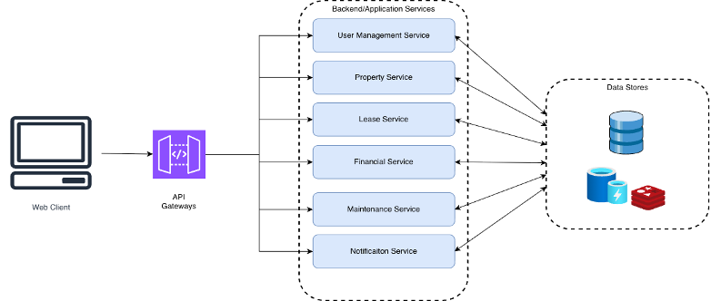

# EazyLiving — Property Management System

A full-stack property management platform built for **ETSU CSCI / AI-ML Spring 2026 — Software Design**.

**Backend:** FastAPI · PostgreSQL · Redis · MongoDB · SQLAlchemy (async)  
**Frontend:** React 18 · Vite · Tailwind CSS · Radix UI  
**Auth:** JWT Bearer tokens · Role-based access control (Tenant / Manager / Owner / Admin)

---

## Table of Contents

1. [Architecture Overview](#architecture-overview)
2. [Prerequisites](#prerequisites)
3. [Environment Setup](#environment-setup)
4. [Running the Backend](#running-the-backend)
5. [Running the Frontend](#running-the-frontend)
6. [Running Tests](#running-tests)
7. [API Reference](#api-reference)
8. [Role Permissions](#role-permissions)
9. [Key Workflows](#key-workflows)
10. [Project Structure](#project-structure)
11. [Troubleshooting](#troubleshooting)

---

## Architecture Overview

```text
┌──────────────────────────────────────────────────┐
│              React / Vite  (port 5173)           │
│  Vite dev-server proxies /api → localhost:8000   │
└───────────────────┬──────────────────────────────┘
                    │  HTTP (proxied)
┌───────────────────▼──────────────────────────────┐
│         FastAPI Gateway  (port 8000)             │
│  /api/v1  — all service routers registered here  │
│  /admin   — SQLAdmin panel                       │
│  /docs    — Swagger UI                           │
└────┬─────────────┬────────────────┬──────────────┘
     │             │                │
┌────▼────┐  ┌─────▼──────┐  ┌─────▼──────┐
│PostgreSQL│  │   Redis    │  │  MongoDB   │
│  :5432   │  │   :6379    │  │   :27017   │
└──────────┘  └────────────┘  └────────────┘
```



**Service layout inside the backend:**

| Service | Responsibility |
| --- | --- |
| `user_service` | Auth (register / login / JWT), user profiles |
| `property_service` | Properties, units, leases, lease requests |
| `payment_service` | Rent payments, process / mark-paid / overdue |
| `maintenance_service` | Maintenance request lifecycle & assignment |
| `notification_service` | In-app notifications via event bus |
| `analytics_service` | Occupancy, revenue, and request statistics |

---

## Prerequisites

| Tool | Minimum version | Install |
| --- | --- | --- |
| Python | 3.12 | [python.org](https://python.org) or `pyenv` |
| Node.js | 18 | [nodejs.org](https://nodejs.org) |
| npm | 9 | bundled with Node |
| PostgreSQL | 14 | `brew install postgresql` / [postgresql.org](https://postgresql.org) |
| Redis | 6 | `brew install redis` / [redis.io](https://redis.io) |
| MongoDB | 6 | `brew install mongodb-community` / [mongodb.com](https://mongodb.com) |
| uv _(optional)_ | any | `pip install uv` — faster dependency install |

---

## Environment Setup

### 1. Clone the repository

```bash
git clone https://github.com/Arthurransome/EazyLiving.git
cd EazyLiving
```

### 2. Create the PostgreSQL databases

```bash
psql -U postgres -c "CREATE DATABASE eazyliving;"
psql -U postgres -c "CREATE DATABASE eazyliving_test;"
```

> Replace `postgres` with your local PostgreSQL superuser if different.

### 3. Configure environment variables

Copy the example and edit as needed:

```bash
cp .env.example .env   # if an example exists, otherwise edit .env directly
```

`.env` (root of project):

```env
# PostgreSQL — main development database
DATABASE_URL=postgresql+asyncpg://<user>:<password>@localhost:5432/eazyliving

# PostgreSQL — isolated test database (never touches dev data)
TEST_DATABASE_URL=postgresql+asyncpg://<user>:<password>@localhost:5432/eazyliving_test

# Redis
REDIS_URL=redis://localhost:6379/0

# MongoDB
MONGO_URL=mongodb://localhost:27017
MONGO_DB=eazyliving

# JWT — change this to a strong random string in any shared environment
JWT_SECRET=your-local-dev-secret
JWT_ALGORITHM=HS256
JWT_EXPIRE_MINUTES=1440
```


### 4. Run database migrations

```bash
alembic upgrade head
```

This creates all tables and enum types in `eazyliving`. The test database is created automatically by the test suite.

---

## Running the Backend

### Option A — using `uv` (recommended, fastest)

```bash
# Install dependencies into a virtual environment
uv sync

# Start the server
uv run uvicorn gateway.main:app --reload
```

### Option B — using standard `pip`

```bash
python -m venv .venv
source .venv/bin/activate        # Windows: .venv\Scripts\activate
pip install -r requirements.txt
uvicorn gateway.main:app --reload
```

### Option C — using the FastAPI CLI

```bash
fastapi dev gateway/main.py
```

The backend starts on **http://localhost:8000**.

| URL | Description |
| --- | --- |
| http://localhost:8000/docs | Swagger UI — interactive API explorer |
| http://localhost:8000/redoc | ReDoc — readable API documentation |
| http://localhost:8000/admin | SQLAdmin panel (login required) |
| http://localhost:8000/health | Health check — returns `{"status": "ok"}` |

---

## Running the Frontend

Open a **second terminal**. The backend must already be running.

```bash
cd frontend
npm install          # first time only
npm run dev
```

The frontend starts on **http://localhost:5173**.

Vite automatically proxies all `/api/*` requests to `http://localhost:8000`, so no CORS configuration is needed during development.

### Frontend scripts

| Command | Description |
| --- | --- |
| `npm run dev` | Development server with hot reload |
| `npm run build` | Production bundle (output in `frontend/dist/`) |
| `npm run preview` | Serve the production build locally |
| `npm run lint` | ESLint check |
| `npm run mocks:smoke` | Run MSW mock smoke tests |

### Mock mode (offline development)

To run the frontend without a backend using Mock Service Worker:

```bash
VITE_USE_MOCKS=true npm run dev
```

---

## Viewing the Docs

The project includes a MkDocs documentation site covering the [User Guide](my-docs/docs/USER_GUIDE.md) and architecture diagrams.

### Install MkDocs (first time only)

```bash
pip install mkdocs mkdocs-material
```

### Serve the docs locally

Open a **third terminal** (backend on 8000, frontend on 5173, docs on 8080):

```bash
cd my-docs
mkdocs serve
```

The docs site starts on **<http://localhost:8080>** — navigate to the URLs below for different sections.

| URL | Description |
| --- | --- |
| <http://localhost:8080> | Home — overview, architecture diagrams |
| <http://localhost:8080/USER_GUIDE> | Full user guide by role |

### Build a static site

```bash
cd my-docs
mkdocs build       # output in my-docs/site/
```

---

## Running Tests

The test suite runs against the **isolated `eazyliving_test` database** — it never touches development data. Each test rolls back its changes automatically.

```bash
# Run all tests
python -m pytest tests/ -q

# Run with verbose output
python -m pytest tests/ -v

# Run a specific test file
python -m pytest tests/test_lease_requests.py -v

# Run with coverage report
python -m pytest tests/ --cov=. --cov-report=html
# Open htmlcov/index.html to view the report
```

**Test database is created automatically** on first run by `tests/conftest.py` if `TEST_DATABASE_URL` is set.

### Test files

| File | What it covers |
| --- | --- |
| `test_api.py` | App startup, docs endpoints, auth registration/login |
| `test_properties_leases.py` | Property & unit CRUD, role-filtered listing, lease lifecycle |
| `test_payments.py` | Payment creation, processing, mark-paid/partial/overdue |
| `test_maintenance.py` | Maintenance state machine, cancellation, escalation |
| `test_notifications.py` | Notification endpoints + event handler unit tests |
| `test_lease_requests.py` | Tenant request workflow, manager approval/rejection |
| `test_migrations.py` | Database enum types and schema validation |

---

## API Reference

All endpoints are prefixed with `/api/v1`. Full interactive docs at `/docs`.

### Authentication

| Method | Endpoint | Description |
| --- | --- | --- |
| POST | `/auth/register` | Create account (`role`: tenant / manager / owner / admin) |
| POST | `/auth/login` | Get JWT access token |
| GET | `/users/me` | Current user profile |
| PUT | `/users/{id}` | Update profile |
| GET | `/users` | List all users (admin only) |

### Properties & Units

| Method | Endpoint | Description |
| --- | --- | --- |
| POST | `/properties` | Create property (owner / admin) |
| GET | `/properties` | List — role-filtered (owner: own; tenant: rented; manager: assigned; admin: all) |
| GET | `/properties/{id}` | Get property |
| PUT | `/properties/{id}` | Update property |
| DELETE | `/properties/{id}` | Delete property |
| PUT | `/properties/{id}/manager` | Assign / remove manager (admin only) |
| GET | `/properties/{id}/tenants` | List active tenants (admin / owner / assigned manager) |
| POST | `/properties/{id}/units` | Add unit |
| GET | `/properties/{id}/units` | List units (`?available=true` for vacant only) |
| GET | `/units/available` | All available units across all properties |
| GET | `/units/{id}` | Get unit |
| PUT | `/units/{id}` | Update unit (includes `is_available` toggle for managers) |
| DELETE | `/units/{id}` | Delete unit |

### Lease Requests (Tenant → Manager approval flow)

| Method | Endpoint | Description |
| --- | --- | --- |
| POST | `/lease-requests` | Tenant submits request for an available unit |
| GET | `/lease-requests` | List — tenant: own; manager: their property (`?pending_only=true`); admin: all |
| GET | `/lease-requests/{id}` | Get a specific request |
| POST | `/lease-requests/{id}/approve` | Approve → auto-creates active lease, marks unit occupied |
| POST | `/lease-requests/{id}/reject` | Reject request |

### Leases

| Method | Endpoint | Description |
| --- | --- | --- |
| POST | `/leases` | Create draft lease (owner / manager / admin) |
| GET | `/leases` | List leases (role-scoped) |
| GET | `/leases/{id}` | Get lease |
| POST | `/leases/{id}/activate` | Activate draft lease |
| POST | `/leases/{id}/terminate` | Terminate active lease |

### Payments

| Method | Endpoint | Description |
| --- | --- | --- |
| POST | `/payments` | Create payment record |
| GET | `/payments` | List (tenant: own; staff: all) |
| GET | `/payments/{id}` | Get payment |
| POST | `/payments/{id}/process` | Tenant pays their bill |
| POST | `/payments/{id}/mark-paid` | Mark as paid (owner / manager / admin) |
| POST | `/payments/{id}/mark-partial` | Mark as partial |
| POST | `/payments/{id}/mark-overdue` | Mark as overdue |

### Maintenance

| Method | Endpoint | Description |
| --- | --- | --- |
| POST | `/maintenance-requests` | Submit request (any authenticated user) |
| GET | `/maintenance-requests` | List (tenant: own; manager: their property; admin: all) |
| GET | `/maintenance-requests/{id}` | Get request |
| PUT | `/maintenance-requests/{id}` | Transition state (`event`: assign / start / complete / close / cancel / escalate) |

### Notifications

| Method | Endpoint | Description |
| --- | --- | --- |
| GET | `/notifications` | List own notifications |
| POST | `/notifications/{id}/read` | Mark single as read |
| POST | `/notifications/read-all` | Mark all as read |
| DELETE | `/notifications/{id}` | Delete notification |

### Analytics

| Method | Endpoint | Description |
| --- | --- | --- |
| GET | `/analytics/summary` | Occupancy rate, revenue, open maintenance (owner / manager / admin) |

---

## Role Permissions

| Action | Tenant | Manager | Owner | Admin |
| --- | --- | --- | --- | --- |
| Browse available units | ✓ | ✓ | ✓ | ✓ |
| Submit lease request | ✓ | — | — | — |
| Approve / reject lease requests | — | ✓ (own property) | ✓ | ✓ |
| Create property | — | — | ✓ | ✓ |
| Assign manager to property | — | — | — | ✓ |
| Add / edit units | — | ✓ (own property) | ✓ | ✓ |
| Toggle unit availability | — | ✓ (own property) | ✓ | ✓ |
| Submit maintenance request | ✓ | ✓ | ✓ | ✓ |
| Assign / escalate maintenance | — | ✓ (own property) | ✓ | ✓ |
| View analytics | — | ✓ (own property) | ✓ | ✓ |
| View all users | — | — | — | ✓ |

> **Manager scope:** A manager only sees properties, leases, maintenance requests, and lease requests that belong to the specific property they have been assigned to by an admin.

---

## Key Workflows

### 1. Tenant finds and requests a unit

```
Tenant registers → GET /units/available → POST /lease-requests
  → Manager notified → POST /lease-requests/{id}/approve
  → Lease auto-created and activated → Tenant notified
```

### 2. Admin onboards a manager

```
Admin creates account for manager (role=manager)
  → PUT /properties/{id}/manager  { manager_id: "..." }
  → Manager now sees that property's data only
```

### 3. Maintenance lifecycle

```
Any user → POST /maintenance-requests  (status: submitted)
  → Manager assigns: PUT /maintenance-requests/{id}  { event: "assign", assigned_to: "..." }
  → PUT { event: "start" } → in_progress
  → PUT { event: "complete" } → completed
  → PUT { event: "close" }  → closed
```

### 4. Rent payment

```
Owner creates payment → POST /payments
  → Tenant pays → POST /payments/{id}/process  { method: "credit_card" }
  → Tenant notified via notification service
```

---

## Project Structure

```
EazyLiving/
├── gateway/                  # FastAPI app entry point
│   ├── main.py               # Router registration, event bus wiring
│   ├── auth.py               # JWT dependency helpers
│   └── admin.py              # SQLAdmin panel setup
│
├── services/
│   ├── analytics_service/    # Occupancy & revenue analytics
│   ├── maintenance_service/  # Maintenance request lifecycle
│   ├── notification_service/ # In-app notification handlers
│   ├── payment_service/      # Payment processing
│   ├── property_service/     # Properties, units, leases, lease requests
│   └── user_service/         # Auth, user profiles
│
├── shared/
│   ├── db/
│   │   ├── models.py         # SQLAlchemy ORM models
│   │   ├── enums.py          # All domain enumerations
│   │   ├── config.py         # Settings (reads .env)
│   │   └── database.py       # Async engine & session factory
│   ├── schemas/              # Pydantic request/response schemas
│   ├── repositories/         # Abstract repository base class
│   ├── factories.py          # Model factory helpers
│   └── events.py             # In-process event bus
│
├── frontend/                 # React / Vite SPA
│   ├── src/
│   │   ├── api/              # API client functions
│   │   ├── pages/            # Route-level page components
│   │   ├── components/       # Shared UI components
│   │   ├── contexts/         # React context providers
│   │   └── mocks/            # MSW mock handlers
│   └── vite.config.js        # Vite config + /api proxy
│
├── tests/                    # Pytest integration & unit tests
├── migrations/               # Alembic migration scripts
├── alembic.ini               # Alembic configuration
├── pyproject.toml            # Python project metadata & pytest config
├── .env                      # Local environment variables (not committed)
└── requirements.txt          # Python dependencies
```

---

## Troubleshooting

### `KeyError: 'access_token'` in tests
Your email domain may be a reserved TLD (`.test`, `.local`, `.example`). Pydantic's `EmailStr` rejects these per RFC 2606. Use `.com` or `.org` domains in test data.

### `MissingGreenlet` / `SQLAlchemy lazy load` error
An ORM relationship is being accessed outside an async context. The fix is to use `selectinload()` in the query or construct the Pydantic response from scalar fields directly rather than calling `model_validate()` on the ORM object.

### `alembic upgrade head` fails — enum already exists
The enum type was created by a previous `create_all` call. Run:
```bash
psql -U <user> -d eazyliving -c "DROP TYPE IF EXISTS user_role CASCADE;"
alembic upgrade head
```

### Backend starts but frontend shows blank page
Make sure the backend is running on port 8000 before starting Vite. The Vite proxy (`/api → localhost:8000`) requires the backend to be up.

### Port already in use
```bash
# Kill whatever is on port 8000
lsof -ti:8000 | xargs kill -9

# Kill whatever is on port 5173
lsof -ti:5173 | xargs kill -9
```

### PostgreSQL connection refused
```bash
# macOS (Homebrew)
brew services start postgresql

# Ubuntu / Debian
sudo systemctl start postgresql
```

### Redis connection refused
```bash
# macOS
brew services start redis

# Ubuntu
sudo systemctl start redis-server
```

### MongoDB connection refused
```bash
# macOS
brew services start mongodb-community

# Ubuntu
sudo systemctl start mongod
```

---

## Development Notes

- **Test isolation:** Tests run against `eazyliving_test` (set via `TEST_DATABASE_URL`). Each test rolls back via SQLAlchemy session — dev data is never touched.
- **Event bus:** Domain events (lease activated, payment paid, etc.) are published in-process via `shared/events.py`. Notification handlers subscribe at startup in `gateway/main.py`.
- **Manager scope:** Managers are scoped to their assigned property. They cannot see or act on data from other properties.
- **Mock mode:** Set `VITE_USE_MOCKS=true` to enable MSW and run the frontend fully offline.
- **Admin panel:** Accessible at `/admin`. Provides a GUI for all database tables. Uses session-cookie auth separate from the JWT API.
