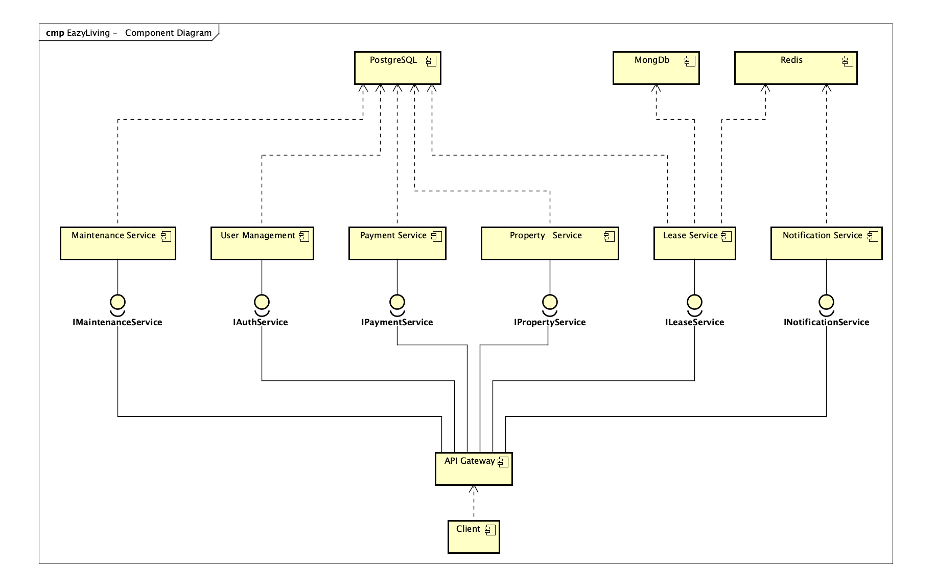

# EazyLiving

**A property management platform for tenants, managers, owners, and administrators.**

---

## What is EazyLiving?

EazyLiving connects everyone involved in renting a home — from the tenant browsing available units to the owner tracking revenue — in one shared platform.

| Role | What you do |
| --- | --- |
| **Tenant** | Browse units, request a lease, pay rent, submit maintenance requests |
| **Manager** | Approve lease requests, manage units, handle maintenance for your property |
| **Owner** | Create properties, add units, review lease offers across all your properties |
| **Admin** | Full access — assign managers, manage all users and data |

---

## Quick Start

1. Open the app at `http://localhost:5173`
2. Click **Register** and choose your role
3. Log in — you are redirected to your role's dashboard automatically

See the [User Guide](USER_GUIDE.md) for step-by-step instructions for every role.

---

## Key Features

- **Lease request workflow** — Tenants request units; managers approve or reject with one click
- **Auto-notifications** — Every significant event triggers an in-app notification to the right person
- **Availability control** — Managers toggle unit availability manually; occupancy updates automatically when a lease activates
- **Role-scoped views** — Each role sees only the data they are authorised to access
- **Maintenance lifecycle** — Full state machine from submission through assignment, completion, and close
- **Payment tracking** — Rent due, paid, partial, and overdue states with tenant alerts

---

## Architecture

### High-Level Design


### Component Diagram



---

## Running the App

```bash
# Backend (port 8000)
uvicorn gateway.main:app --reload

# Frontend (port 5173) — in a second terminal
cd frontend && npm run dev
```

Full setup instructions (databases, environment variables, migrations) are in the project [README](../../README.md).
